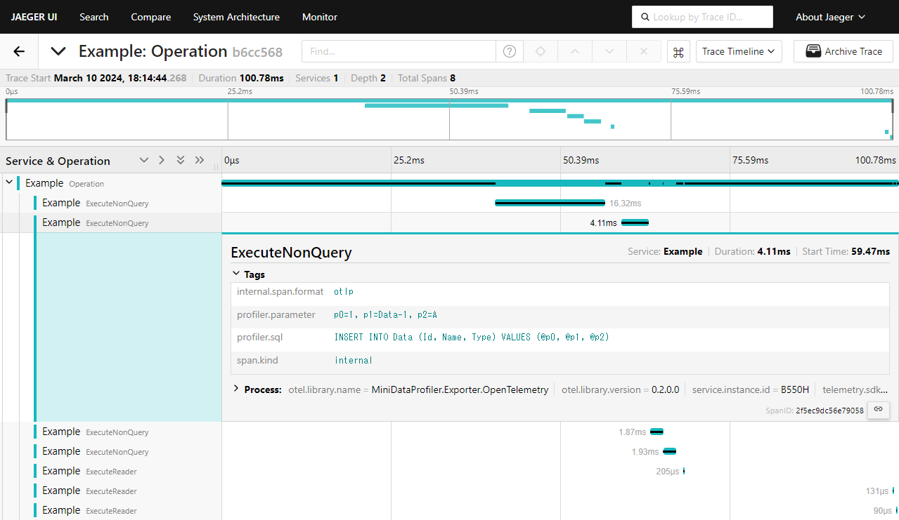

# mini-data-profiler

| Package | Info | Description |
|-|-|-|
| MiniDataProfiler | [](https://www.nuget.org/packages/MiniDataProfiler/) | Core |
| MiniDataProfiler.Exporter.Logging | [](https://www.nuget.org/packages/MiniDataProfiler.Exporter.Logging/) | Microsoft.Extensions.Logging exporter |
| MiniDataProfiler.Exporter.OpenTelemetry | [](https://www.nuget.org/packages/MiniDataProfiler.Exporter.OpenTelemetry/) | OpenTelemetry exporter |

## What is this?

* Simple profiler for ADO.NET



## Usage

```csharp
// Setup Logger
using var loggerFactory = LoggerFactory.Create(builder =>
{
    builder
        .AddFilter("MiniDataProfiler.Exporter.Logging", LogLevel.Information)
        .AddConsole();
});
var logExporter = new LoggingExporter(loggerFactory.CreateLogger<LoggingExporter>(), new LoggingExporterOption());

// Setup OpenTelemetry
using var tracerProvider = Sdk.CreateTracerProviderBuilder()
    .ConfigureResource(config =>
    {
        config.AddService("Example", serviceInstanceId: Environment.MachineName);
    })
    .AddMiniDataProfilerInstrumentation()
    .AddOtlpExporter(config =>
    {
        config.Endpoint = new Uri("http://otlp-exporter:4317");
    })
    .Build();

// Exporters
var exporter = new ChainExporter(logExporter, new OpenTelemetryExporter(new OpenTelemetryExporterOption()));

// Use ProfileDbConnection
using var con = new ProfileDbConnection(exporter, new SqliteConnection(connectionString));
...
```
